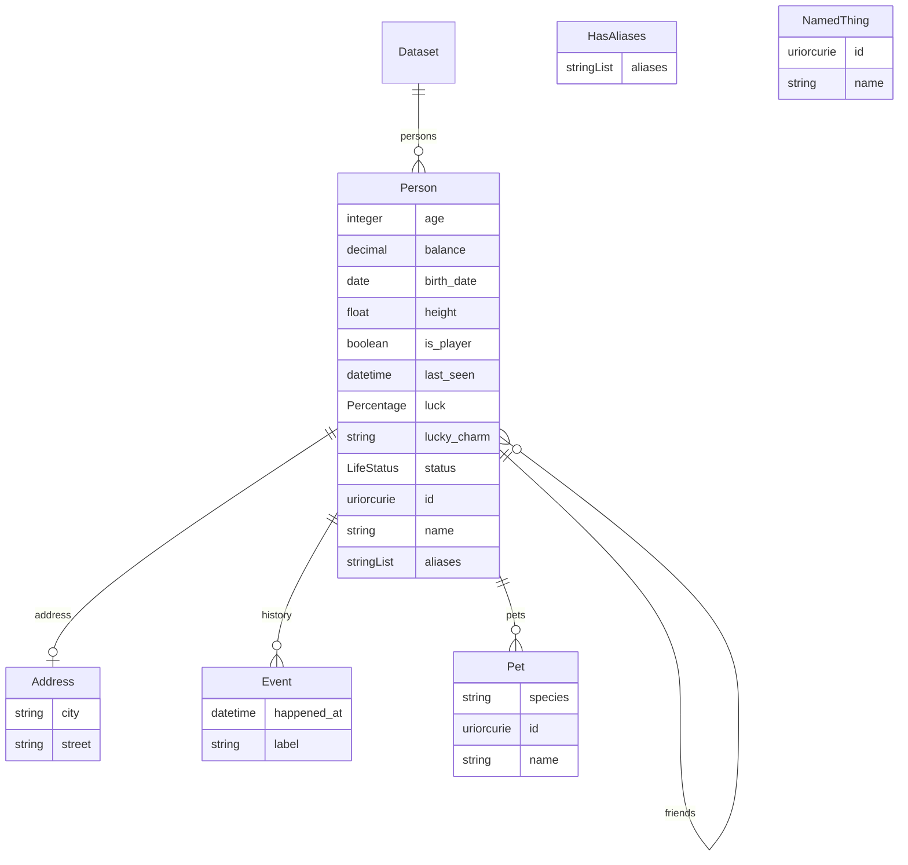

```mermaid
erDiagram
Address {
    string city
    string street
}
Dataset {

}
Event {
    datetime happened_at
    string label
}
HasAliases {
    stringList aliases
}
NamedThing {
    uriorcurie id
    string name
}
Person {
    integer age
    decimal balance
    date birth_date
    float height
    boolean is_player
    datetime last_seen
    Percentage luck
    string lucky_charm
    LifeStatus status
    uriorcurie id
    string name
    stringList aliases
}
Pet {
    string species
    uriorcurie id
    string name
}

Dataset ||--}o Person : "persons"
Person ||--|o Address : "address"
Person ||--|o Person : "best_friend"
Person ||--}o Event : "history"
Person ||--}o Person : "friends"
Person ||--}o Pet : "pets"

```
